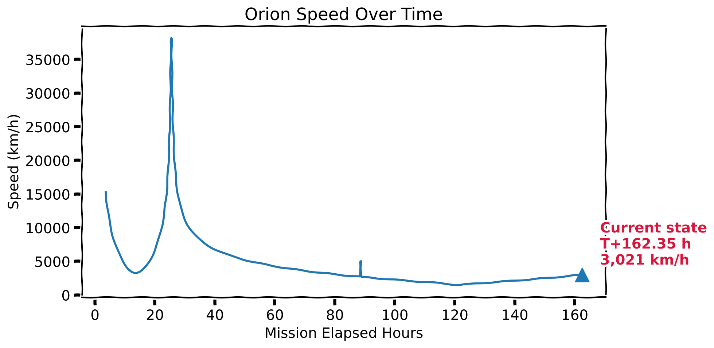
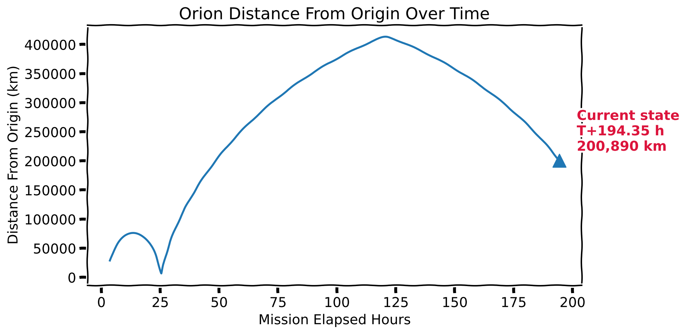
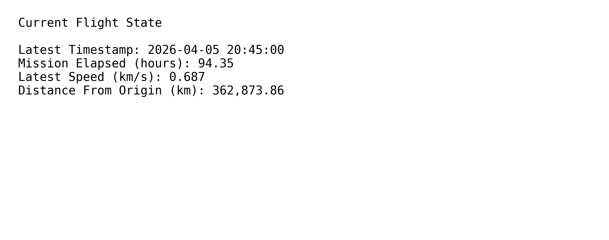

# fsdh-artemis-demo

Artemis II mission overview generated from Databricks using a prototype FSDH pipeline.

## 🚀 Mission Summary
- **Latest Orion timestamp:** 2026-04-10 06:40:00
- **Latest speed:** 1.732 km/s
- **State vector count:** 2361
- **Mission duration:** 196.67 hours

## 📈 Trajectory Analytics

### Orion Speed Over Time

### Orion Distance Over Time

### Summary Values

